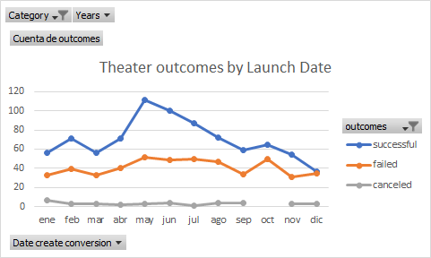
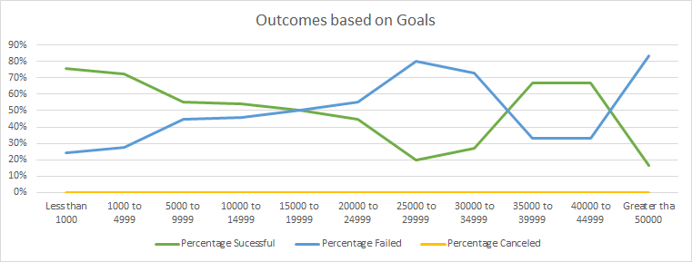

# Kickstarter-Challenge
Based Data about Kickstarter campaigns

## Overview of Project
It´s a deep analysis of outcomes of Kickstarter´s campaigns related to their launch date and their goals.

### Purpose
This analysis was made to have a more complete database for decision-making about different campaigns fundraising.

## Analysis and Challenges
It was very helpful to use line charts to describe trends based on the database of Kickstarter, because, they show a better understanding of the information about the launch date and goals, both correlated to outcomes. 
When you use formulas to calculate some important information, they help us to analyze a big database easier than manual ways like this document that has 4,115 rows and 21 columns.
Something important in doing analysis, is being confident that the information is correct, one challenge I encounter was a chart without sense, so I had deleted and did the chart again and again until finding the error, literally was a single missing letter in the formula, that modify the results. Hence, is necessary the verify the results.  

### Analysis of Outcomes Based on Launch Date

Based on this chart the launched date has an association with the success of the campaign. May, June, and July are the better months to launch the theater campaign with an outcome upper than 80. The failed line is similar during the year between 30 and 50 outcomes, May is the upper Month with 52 outcomes, however, the success in this month is 100 outcomes, so is convenient to launch the campaign this month, there is more to win than lose. The canceled line is not significant in this chart.

### Analysis of Outcomes Based on Goals

Based on this chart the upper percentage of successful in plays campaign is when the goal is less than $1,000 with 76%  of the projects. And the second is when the Goal is between $35,000 and $44,999 with 67% of the projects. On the contrary, the upper percentage of failed in plays campaigns are projected greater than $50,000 with 83%, then the projects between $25,000 and $29,999 with 80%. As a result, is more probably to have success if the plays campaign has a goal of less than $1,000, and then a campaign with a goal between $35,000 and $44,999 in this case, improves the probability of success and reduce the probability of failure. 

### Challenges and Difficulties Encountered
I used formulas that I never used before, “Countifs”, I wasn´t sure that the criteria that I chose were correct, so, was difficult to know because I had to prove it until having the correct result. Also, having little information limits the analysis, finally, the README is another challenge that I´m discovering how to use.

## Results

- What are two conclusions you can draw about the Outcomes based on Launch Date?
First, The best month to launch the theater campaign is in May, then June and July. Second, the worst months to launch the theater campaign are December with less probability of success and October with almost the same probability of success and failure.

- What can you conclude about the Outcomes based on Goals?
There are more plays campaign with success with a small Goal of less than $1,000, reducing the probability of failure.

- What are some limitations of this dataset?
For a better analysis, the cause for the outcome is needed.  

- What are some other possible tables and/or graphs that we could create?
The interaction of outcomes and pledged. Also comparing the success information in other countries.
